<div align="center">

# 🛰️ Survex

### On-chain surveys with custom token rewards on Stellar Soroban

A decentralized survey-builder dApp where creators publish surveys on-chain, escrow XLM rewards inside a Soroban smart contract, and respondents are paid automatically the instant they submit a valid response. Both the creator and the respondent also earn **`SXP`** — a custom Soroban token (`SurvexPointsToken`) minted by a companion contract.

[](https://stellar-survex.vercel.app/)
[](https://stellar.expert/explorer/testnet)
[](#-tech-stack)
[](https://github.com/Suryashish/stellar-survex/actions/workflows/ci.yml)

[**🚀 Open the live app →**](https://stellar-survex.vercel.app/)

</div>

---

## ✨ Highlights

| | |
| --- | --- |
| 💰 **Trustless XLM escrow** | `reward × max_responses` is locked inside the survey contract on creation; payouts happen atomically on `submit_response`. |
| 🪙 **Custom `SXP` token** | A separate Soroban token contract (`SurvexPointsToken`) mints `SXP` to the creator on publish and to each respondent on submit. Cross-contract `mint()` is gated to a single registered minter (the survey contract). |
| 🤝 **Shared admin (co-admins)** | The original creator can grant manage rights to other wallets. Co-admins can pause / resume / extend / close, manage the response whitelist, and edit the visibility list. They **cannot** withdraw escrowed funds or add/remove other co-admins. |
| 🔒 **Public / Private surveys** | Private surveys are hidden from the Explore grid for non-listed wallets, blocked at the contract level on `submit_response`, and gated on the shared link page. Admin and co-admins always retain view access. |
| ✋ **Wallet-level dedup** | One response per address per survey, enforced on-chain. |
| 📜 **Optional response whitelist** | Orthogonal to visibility — gates which wallets may submit when enabled. |
| ♻️ **Lifecycle controls** | Pause, resume, extend, close, and `withdraw_unused_funds` once a survey is closed or expired. |
| 👛 **Freighter wallet** | All signing happens client-side via `@stellar/freighter-api`. |
| 📊 **CSV export** | Download every response for analytics. |
| 🛠 **In-app setup wizard** | Bootstrap the points-token integration without ever touching `stellar-cli` after deploy. |
| 📱 **Fully responsive** | First-class mobile experience for both managing and answering surveys. |

---

## 📒 Contract Addresses (Stellar Testnet)

| Purpose | Address | Explorer |
| --- | --- | --- |
| **SurveyBuilder contract** | `CCKBIHX4IDKT77IVKTQVBA6IYICO2W6PVBCU43QUXZUA4PAH6YC2O2XJ` | [View on Stellar Expert ↗](https://stellar.expert/explorer/testnet/contract/CCKBIHX4IDKT77IVKTQVBA6IYICO2W6PVBCU43QUXZUA4PAH6YC2O2XJ) |
| **`SXP` Points Token contract** | `CD5KW3UM3M7SW3UIVP4FYA4GMHXP7M7W2QTCFUR4HKDNZ6ZVH2FUPG5M` | [View on Stellar Expert ↗](https://stellar.expert/explorer/testnet/contract/CD5KW3UM3M7SW3UIVP4FYA4GMHXP7M7W2QTCFUR4HKDNZ6ZVH2FUPG5M) |
| **Native XLM SAC** (XLM reward asset) | `CDLZFC3SYJYDZT7K67VZ75HPJVIEUVNIXF47ZG2FB2RMQQVU2HHGCYSC` | [View on Stellar Expert ↗](https://stellar.expert/explorer/testnet/contract/CDLZFC3SYJYDZT7K67VZ75HPJVIEUVNIXF47ZG2FB2RMQQVU2HHGCYSC) |
| Network | `Test SDF Network ; September 2015` | — |
| Soroban RPC | `https://soroban-testnet.stellar.org` | — |
| Horizon | `https://horizon-testnet.stellar.org` | — |

Both contract ids live in [lib/stellar.js](lib/stellar.js#L25-L33).

### 🔁 Live cross-contract minting transactions

Each `create_survey` and `submit_response` triggers a cross-contract `mint()` on the points-token. Two real on-chain examples:

- **`create_survey` → mint to creator:** [`5eddd9e6…f0e545b` ↗](https://stellar.expert/explorer/testnet/tx/5eddd9e6b0517d924a81dcb852ee22e88eff7f40c17648bda0d84db7bf0e545b)
- **`submit_response` → mint to respondent:** [`df6dc028…b71bbcbb5f` ↗](https://stellar.expert/explorer/testnet/tx/df6dc0286d57c27a20d8ffcb6ad6c50635bae9a31ace0df3118580b71bbcbb5f)

---

## 🖼️ Screenshots

### Desktop — full app tour

<table>
  <tr>
    <td width="50%">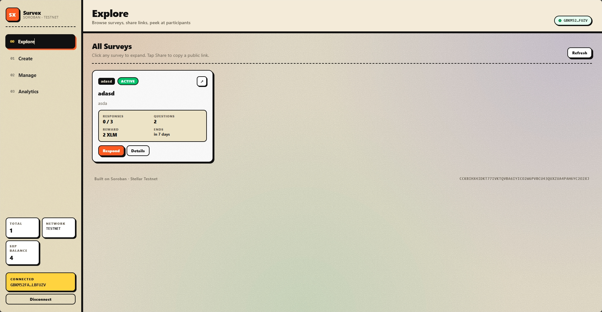</td>
    <td width="50%">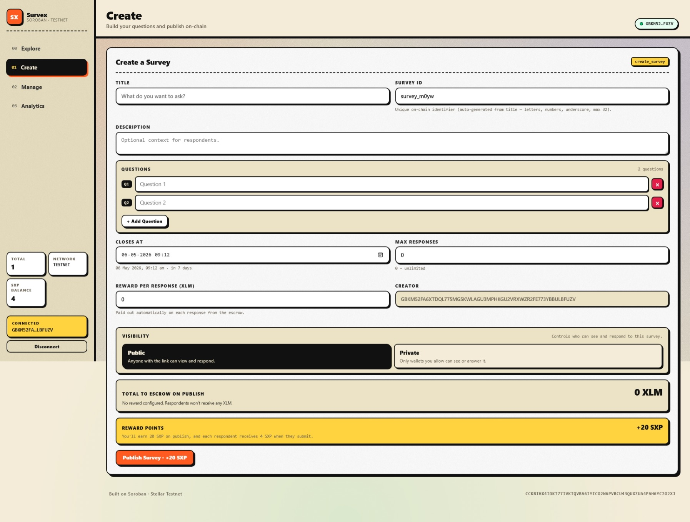</td>
  </tr>
  <tr>
    <td width="50%">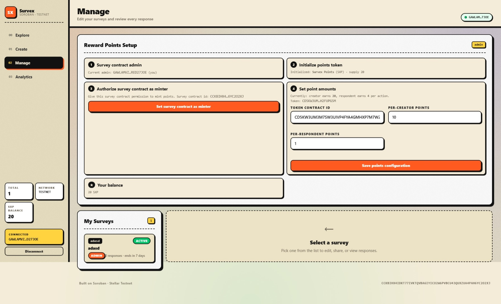</td>
    <td width="50%">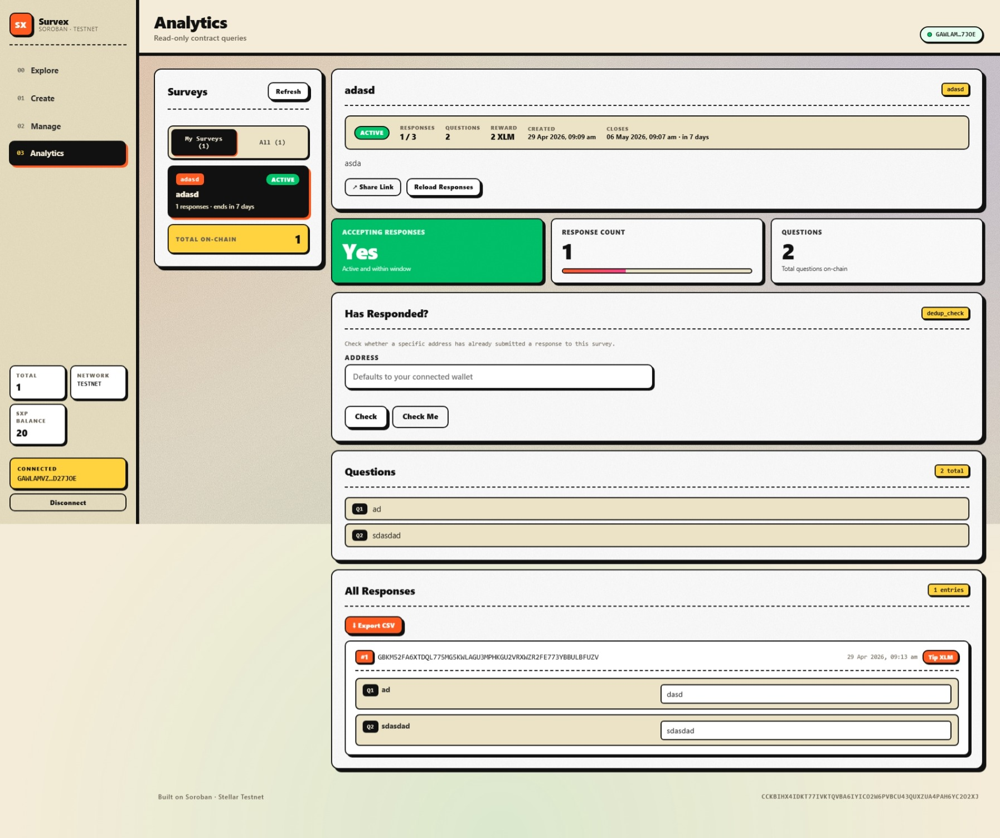</td>
  </tr>
</table>

### Survey card

<p align="center">
  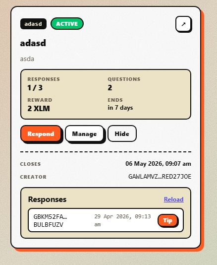
</p>

### Public responder page

<table>
  <tr>
    <td width="50%">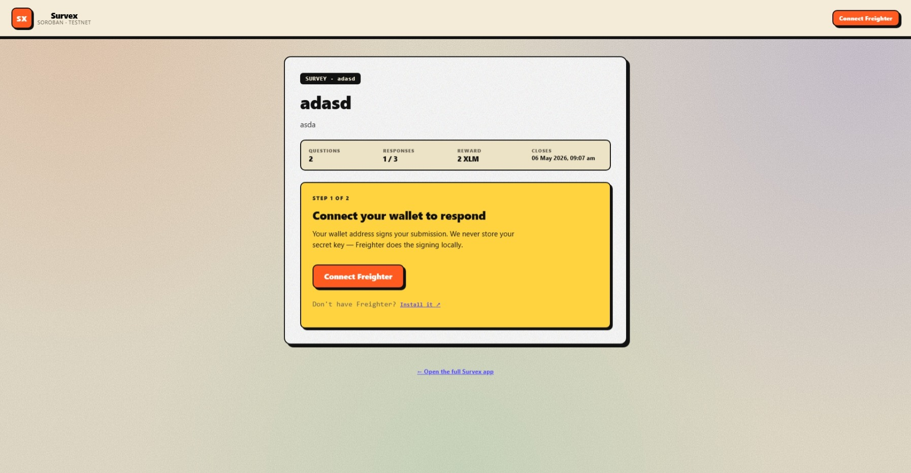</td>
    <td width="50%">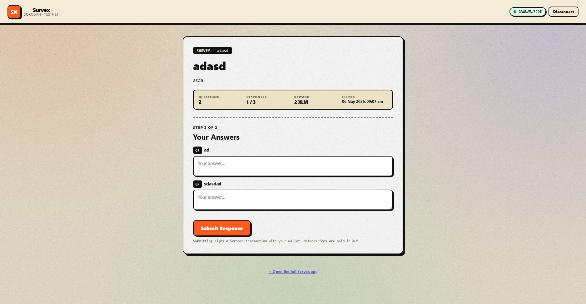</td>
  </tr>
</table>

### Mobile — fully responsive

<table>
  <tr>
    <td width="25%">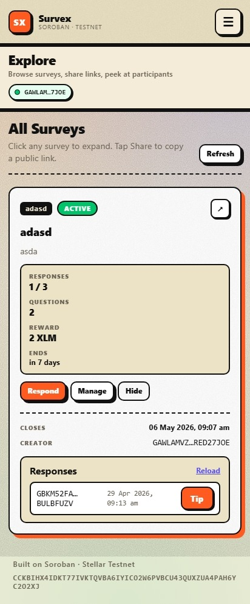</td>
    <td width="25%">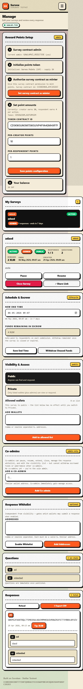</td>
    <td width="25%">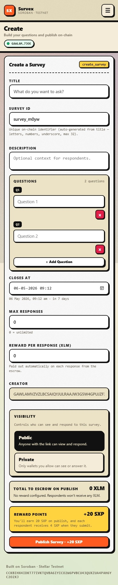</td>
    <td width="25%">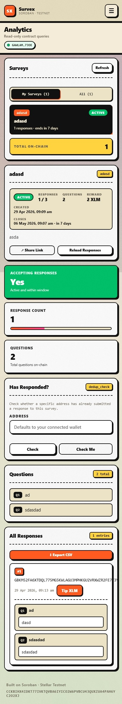</td>
  </tr>
</table>

### Mobile responder form

<p align="center">
  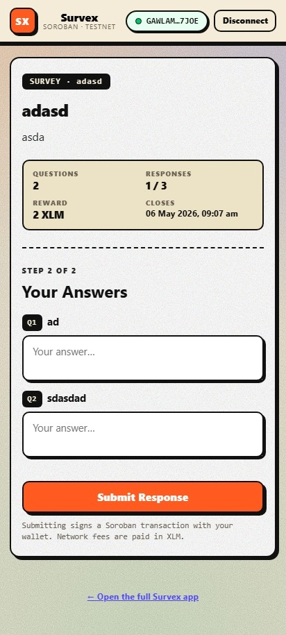
</p>

### CI/CD pipeline

<p align="center">
  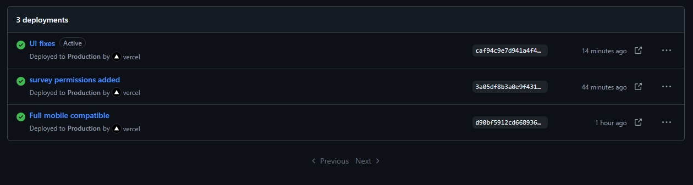
</p>

[](https://stellar-survex.vercel.app/)
[](https://github.com/Suryashish/stellar-survex/actions/workflows/ci.yml)

Two pipelines run on every push to `main`:

- **GitHub Actions** ([.github/workflows/ci.yml](.github/workflows/ci.yml)) — builds the Vite frontend (with lint) and compiles **both** Soroban contracts (`hello-world` and `points-token`) to WASM on every push and pull request. WASM artifacts are uploaded for download.
- **Vercel** — auto-deploys the frontend to [stellar-survex.vercel.app](https://stellar-survex.vercel.app/) on every push to `main`.

---

## 🧱 Tech Stack

- **Frontend** — React 19 · Vite 8
- **Wallet** — `@stellar/freighter-api`
- **Chain SDK** — `@stellar/stellar-sdk` (Soroban RPC client)
- **Smart contracts** — Rust + `soroban-sdk` (`#![no_std]`), two-crate Cargo workspace
- **Hosting** — Vercel (frontend) · Stellar Testnet (contracts)

---

## 📁 Project Structure

```
.
├── contract/                       # Soroban workspace (Rust)
│   └── contracts/
│       ├── hello-world/            # SurveyBuilder contract
│       │   └── src/lib.rs
│       └── points-token/           # SurvexPointsToken (SXP) contract
│           └── src/lib.rs
├── lib/stellar.js                  # Bindings & RPC client for both contracts
├── src/
│   ├── App.jsx                     # Root app, routing, state
│   ├── pages/                      # Explore / Create / Manage / Analytics / SharedRespond
│   ├── components/                 # Field, Section, TxDrawer, PaymentModal, …
│   └── utils/                      # constants, survey helpers, CSV export
├── pictures/                       # README screenshots (1.jpeg … 13.jpeg)
└── package.json
```

---

## 🪙 The `SXP` token

`SXP` ("**S**urve**x P**oints") is a small Soroban token — separate contract, separate WASM — used purely as on-chain reward points. It lives at:

> **`CD5KW3UM3M7SW3UIVP4FYA4GMHXP7M7W2QTCFUR4HKDNZ6ZVH2FUPG5M`** · [Stellar Expert ↗](https://stellar.expert/explorer/testnet/contract/CD5KW3UM3M7SW3UIVP4FYA4GMHXP7M7W2QTCFUR4HKDNZ6ZVH2FUPG5M)

### How rewards flow

```
      ┌───────────────────────┐                        ┌────────────────────────┐
      │  SurveyBuilder        │ ── #[contractclient] ▶ │  SurvexPointsToken     │
      │  (CCKBIHX4…O2XJ)      │      mint(caller,…)    │  (CD5KW3UM…PG5M)       │
      └───────────────────────┘ ◀── auth-as-minter ─── └────────────────────────┘
              │                                                   ▲
   create_survey() ─────── mints `creator_points` to creator ─────┤
   submit_response() ───── mints `respondent_points` to respondent┘
```

- Both rewards are minted in the **same transaction** as the original action — points and the on-chain action succeed or fail together.
- The XLM reward (escrowed in the survey contract) and the `SXP` reward (minted by the points-token) are independent — surveys with zero XLM reward still mint `SXP` if configured.
- Mint authority on the token is gated to a single registered minter (the survey contract); only the token admin can rotate it.

### Verified on testnet

Two real cross-contract mint events you can inspect on Stellar Expert:

| Action | Tx hash |
| --- | --- |
| `create_survey` → mints `SXP` to creator | [`5eddd9e6b0517d924a81dcb852ee22e88eff7f40c17648bda0d84db7bf0e545b`](https://stellar.expert/explorer/testnet/tx/5eddd9e6b0517d924a81dcb852ee22e88eff7f40c17648bda0d84db7bf0e545b) |
| `submit_response` → mints `SXP` to respondent | [`df6dc0286d57c27a20d8ffcb6ad6c50635bae9a31ace0df3118580b71bbcbb5f`](https://stellar.expert/explorer/testnet/tx/df6dc0286d57c27a20d8ffcb6ad6c50635bae9a31ace0df3118580b71bbcbb5f) |

---

## 🧬 Smart Contract APIs

### SurveyBuilder ([contract/contracts/hello-world/src/lib.rs](contract/contracts/hello-world/src/lib.rs))

#### Mutating — survey lifecycle
- `create_survey(id, creator, title, description, questions, end_time, max_responses, reward_per_response, reward_token)` — escrows `reward × max_responses` upfront. Mints `creator_points` to the creator if points are configured.
- `pause_survey(id, caller)` · `resume_survey(id, caller)` · `close_survey(id, caller)` · `extend_survey(id, caller, new_end_time)` — admin **or** co-admin.
- `withdraw_unused_funds(id, creator)` — original creator only.

#### Mutating — co-admins (creator only)
- `add_co_admin(id, creator, addr)` · `remove_co_admin(id, creator, addr)`

#### Mutating — visibility & viewers (admin or co-admin)
- `set_visibility(id, caller, is_private)` — flip public ⇄ private.
- `add_allowed_viewers(id, caller, addresses)` · `remove_allowed_viewer(id, caller, addr)`

#### Mutating — response whitelist (admin or co-admin)
- `enable_whitelist(id, caller)` · `add_to_whitelist(id, caller, addresses)`

#### Mutating — response submission
- `submit_response(survey_id, respondent, answers)` — auto-pays XLM from escrow, mints `respondent_points` if points are configured, and rejects with `NotAllowedViewer` when the survey is private and the respondent is neither admin/co-admin nor on the viewers list.

#### Mutating — points-token configuration
- `init_admin(admin)` — one-time bootstrap. The first wallet to call this becomes the contract admin.
- `set_points_config(admin, token, creator_points, respondent_points)` — admin only. Wires the survey contract to a points-token and sets reward amounts.

#### Read-only
- `get_survey` · `list_surveys` · `get_total_count`
- `get_response_count` · `has_responded` · `is_accepting_responses` · `get_responses`
- `get_co_admins` · `is_co_admin`
- `get_allowed_viewers` · `is_private` · `can_view`
- `get_contract_admin` · `get_points_config`

### SurvexPointsToken ([contract/contracts/points-token/src/lib.rs](contract/contracts/points-token/src/lib.rs))

#### Mutating
- `initialize(admin, name, symbol, decimals)` — one-time setup.
- `set_minter(admin, minter)` — admin authorises a single minter address (the survey contract).
- `mint(caller, to, amount)` — admin or registered minter only.
- `transfer(from, to, amount)` — standard balance transfer.

#### Read-only
- `balance(addr)` · `name` · `symbol` · `decimals` · `total_supply` · `admin` · `minter`

---

## 🚀 Getting Started

### Prerequisites
- Node.js 18+
- [Freighter Wallet](https://www.freighter.app/) (Testnet mode, funded via friendbot)
- Rust + `stellar-cli` (only if you want to rebuild/redeploy the contracts)

### Run the frontend

```bash
npm install
npm run dev
```

Open **http://localhost:5173** and connect Freighter on Testnet.

### Build for production

```bash
npm run build
npm run preview
```

---

## 🛠 Rebuilding & redeploying the contracts

The workspace at [contract/](contract/) has **two** crates: `hello-world` (the SurveyBuilder) and `points-token` (the `SXP` token). `stellar contract build` produces a `.wasm` for each.

```bash
cd contract
stellar contract build

# (only the first time on a fresh machine)
stellar keys generate alice2
stellar keys fund alice2 --network testnet

# 1. Deploy the points token first.
stellar contract deploy \
  --wasm target/wasm32v1-none/release/points_token.wasm \
  --source-account alice2 \
  --network testnet
# → CXXX… (this is your POINTS_TOKEN_ID)

# 2. Then deploy the survey contract.
stellar contract deploy \
  --wasm target/wasm32v1-none/release/hello_world.wasm \
  --source-account alice2 \
  --network testnet
# → CYYY… (this is your CONTRACT_ID)
```

Update both ids in [lib/stellar.js](lib/stellar.js):

```js
export const CONTRACT_ID     = "CYYY…";   // line 25
export const POINTS_TOKEN_ID = "CXXX…";   // line 33
```

### Wiring the points integration (no CLI needed)

Open the app → connect Freighter → **Manage** tab → the **"Reward Points Setup"** panel walks you through four clickable steps:

1. **Claim admin role** — calls `init_admin` on the survey contract. The wallet that does this becomes the contract admin.
2. **Initialize points token** — sets the token's name / symbol / decimals (defaults: `Survex Points` / `SXP` / `0`).
3. **Authorize survey contract as minter** — calls `set_minter` on the token, granting the survey contract the right to mint.
4. **Save points configuration** — sets the token address and per-creator / per-respondent point amounts on the survey contract.

Once all four steps are complete, the setup panel is hidden from every wallet **except the admin's**, and the rest of the UI starts surfacing reward badges (sidebar balance, "+N PTS" hint on the publish button, points card on Create).

---

## 📖 Feature notes

### Co-admins
- Only the original creator can `add_co_admin` / `remove_co_admin`.
- Co-admins gain manage access from the Explore grid (Manage button) and the Manage tab.
- The Manage list shows a role badge (`Admin` / `Co-admin`) on each item.
- Withdrawing escrowed XLM stays creator-only — co-admins can't pull funds.

### Public / Private surveys
- Visibility is **independent** of the response whitelist:
  - **Visibility** gates who can *see and answer* a survey.
  - **Response whitelist** gates who can *submit* once a survey is visible.
- The contract's `can_view(id, addr)` returns true for the creator, all co-admins, and any address in the allowed-viewers list.
- Admin and co-admins are implicitly viewers regardless of list membership — no need to add yourself.
- The shared link page (`?survey=<id>`) shows a "🔒 This survey is private" panel to non-listed wallets.

### Reward points
- Both rewards are minted in the same transaction as the original action — atomic with the on-chain write.
- The XLM reward and the `SXP` reward are independent — surveys with zero XLM reward still mint `SXP` if configured.
- The shared respond page intentionally surfaces only the **XLM** reward — `SXP` is an internal "bonus" surfaced in the main app's Create / sidebar UI and on the Manage admin panel.

---

## 🌐 Deploying the frontend to Vercel

1. Push this repo to GitHub.
2. Import the project at [vercel.com/new](https://vercel.com/new).
3. Framework preset: **Vite** · Build command: `npm run build` · Output dir: `dist`.
4. Deploy — every push to `main` triggers an automatic rebuild.

This is exactly how [stellar-survex.vercel.app](https://stellar-survex.vercel.app/) is deployed.

---

## 📜 License & Ownership

This project is owned and maintained by [**@Suryashish**](https://github.com/Suryashish), who reserves all rights to the codebase, the deployed contracts, and the `SXP` token.

Unauthorized reproduction, redistribution, or commercial use of any part of this repository — including the smart contracts, frontend, designs, and assets — is not permitted without explicit written permission from the owner.

© [Suryashish](https://github.com/Suryashish). All rights reserved.

